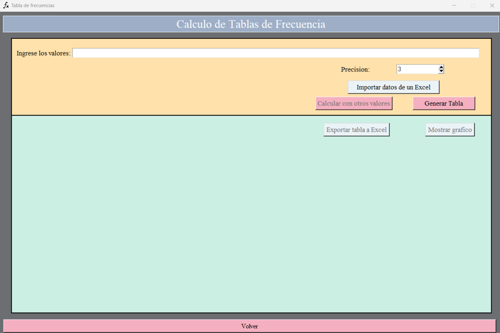
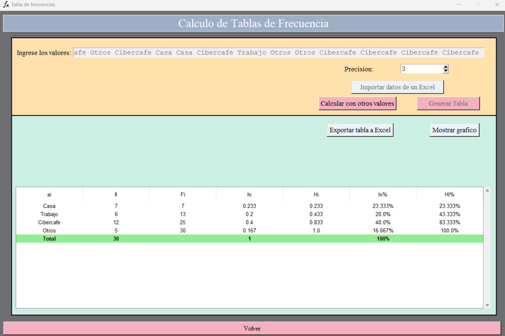
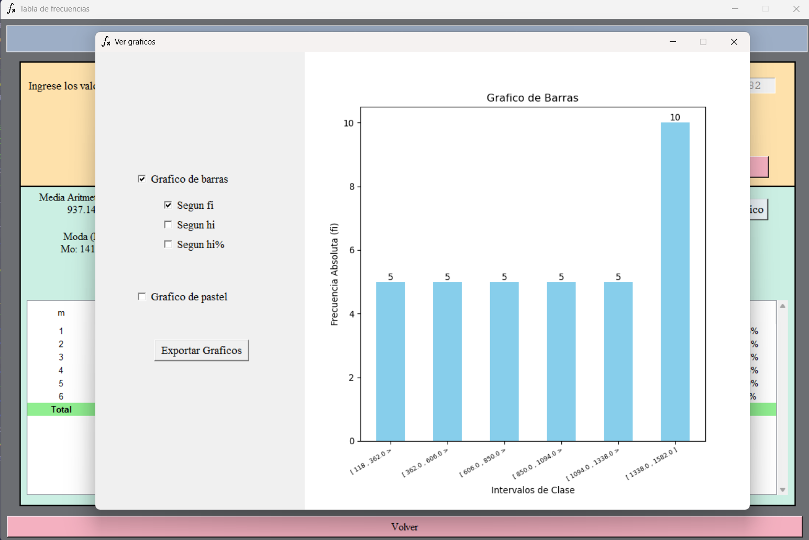

# StatPhi (V1.7)

StatPhi es una aplicacion de escritorio que permite a los usuarios realizar calculos estadisiticos, basados en los diferentes datos obtenidos de una investigacion estadistica a una muestra.

## Tabla de Contenidos

- [Descripcion](#descripcion)
- [Caracteristicas](#features)
- [Caracteristicas proximas](#features-to-add)
- [Estructura del proyecto](#estructura-del-proyecto)
- [Instalacion](#instalacion)
- [Uso](#uso)

## Descripcion

StatPhi es un programa desarrollado en el lenguaje de programacion Python, usando la libreria tkinter como base desarrollar la UI y la libreria numpy y pandas para los calculos y exportacion de archivos. 
Este proyecto es el producto final del curso de Estadistica General 2025-0 el cual tiene por objetivo brindar una forma facil y amigable de calcular y analizar datos a personas que no estan familiarizadas con software avanzado como RStudio.

Con StatPhi, podras ingresar todos los datos obtenidos correspondientes a una o varias variables y obtener informacion relevante sobre esta, como la distribucion de frecuencias , graficos y medidas de resumen. 
 
Tienes la posibilidad de ingresar datos por tu cuenta, o de importarlos de un archivo .xlsx (Excel) externo, ten en cuenta que solo podras importar datos correspondientes a 5 columnas como maximo. 
Al importar multiples columnas de un archivo .xlsx y al calcular la tabla de frecuencias y las medidas de resumen de cada una, tendras la posibilidad de visualizar los resultados por separado, ademas de que podras exportar solo las tablas y los graficos que consideres necesarios. 

## DEMO




## Caracteristicas
Algunas caracteristicas importantes de StatPhi son:
* Trabaja con variables cuantitativas y cualitativas.
* Posibilidad de importar datos de un archivo Excel (.xlsx) externo, desde datos correspondientes a una sola columna hasta un maximo de 5 columnas de datos.
* Obten un archivo Excel con la(s) tabla(s) de frecuencias generada.
* Muestra un grafico sobre la distribucion de frecuencias.
* Obten las imagenes de los graficos en baja o alta calidad (hasta 1200 DPI).

## Caracteristicas proximas
- [x] Posibilidad de importar multiples columnas de un Excel (v1.7)
- [x] Calculo de cuantiles.
- [x] Visualizacion de grafico de cajas.
- [] Creacion y exportacion de multiples graficos en una sola imagen.
- [] Importacion de datos de archivos .csv .txt .sql
- [] Implementacion de librerias para acelerar la importacion y analisis de miles de datos.
## Estructura del proyecto

## Instalacion

Por el momento, no esta disponible un ejecutable que facilite su instalacion y uso, esto debido a que el proyecto todavia esta en fase de construccion y pruebas.

### Requisitos previos
 Pero si deseas probar StatPhi en tu ordenador, deberas tener intalado los siguientes programas:
- Un editor de codigo como VSCode.
- Python 3.11.X

### Librerias Necesarias
Ademas, deberas contar con las siguientes librerias de python (puedes usar pip o conda),
1. tkinter
2. pandas 2.2.3
3. matplotlib 3.10.0
4. openpyxl 3.1.5
5. scipy 1.15.1

> [!IMPORTANT] 
> Si ya tienes librerias instaladas, es recomendable crear un entorno virtual para evitar conflictos con las diferentes librerias de tu sistema.

### Pasos para la Instalacion
1. Clonar el repositorio.
    ```bash
    https://github.com/JunixOs/app_escritorio_estadistica.git
    ```
2. Navegar hasta el directorio app_escritorio_estadistica:
    ```bash
    cd app_escritorio_estadistica
    ```
3. Crear el entorno virtual. Si no sabes como, ingresa los siguientes comandos dentro de la terminal:
    ```bash
    python -m venv nombre_del_entorno
    python -m venv venv
4. Activar el entorno virtual:
    ```bash
    .\venv\Scripts\activate
    ```
3. Instalar las librerias.
4. Ejecutar el programa con el comando:
    ```bash
    python ./Windows/Main_Window.py
    ```
5. Disfruta.

## Uso
### Pantalla de Inicio

En la pantalla de inicio te encontraras con 2 botones, uno para dirigirte a la seccion de calculo de tablas de frecuencias y otro para abrir una pequeña ventana donde podras calcular el tamaño de muestra usando el Muestreo Aleatorio Simple.

#### Calculo de Tablas de Frecuencias

Aqui te encontraras con los siguientes elementos:
- Campo de texto: 
    Aqui puedes ingresar datos de manera manual, para un calculo correcto, asegurate de separar los datos por espacio y de usar puntos decimales en lugar de comas.

- Precision:
    Permite ajustar la cantidad de decimales que se mostraran en valores como las Medidas de Resumen , la Frecuencia Relativa (hi) , la Frecuencia Relativa Acumulada (Hi) y sus respectivos valores porcentuales (hi% y Hi%), si ves que los valores no cambian, se debe a que se ha alcanzado el numero maximo de decimales para los datos (no hay mas decimales por mostrar).

- Importar datos de un Excel:
    Permite importar datos de una o varias columnas de un archivo .xlsx externo.

#### Calculo de Tamaño de Muestra por M.A.S.